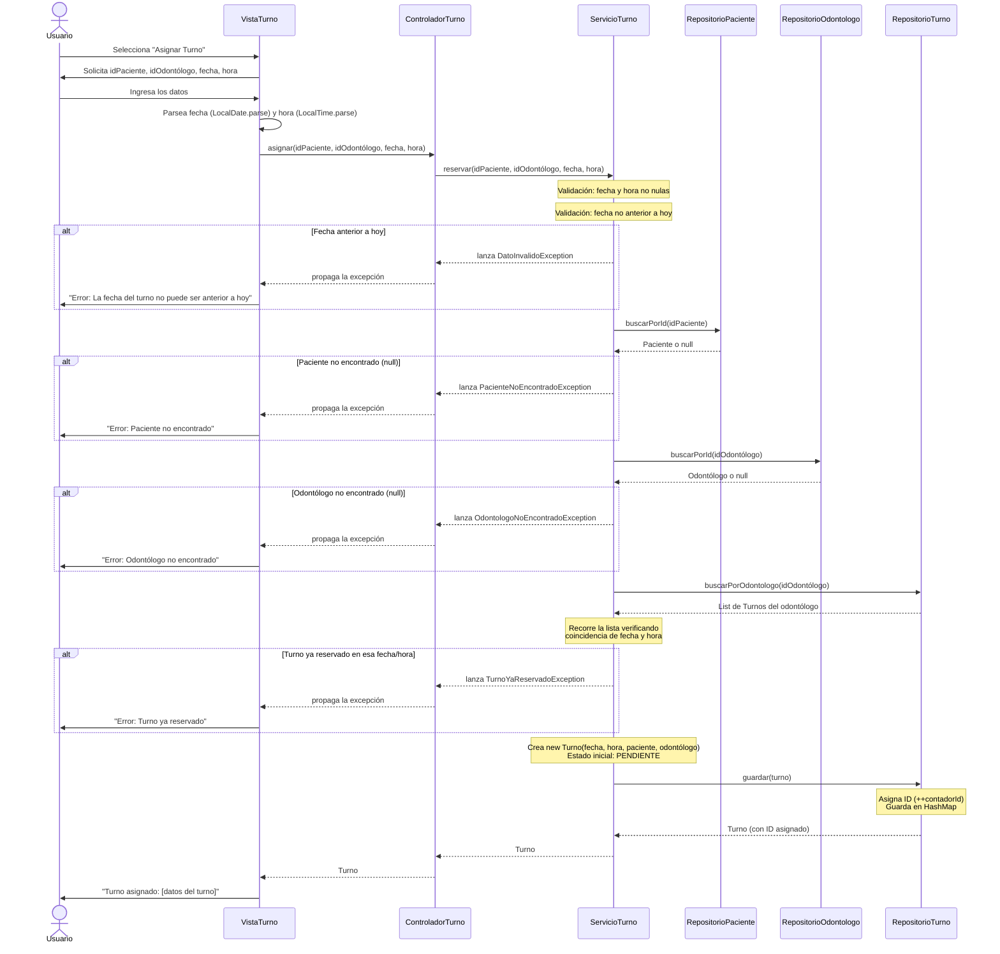
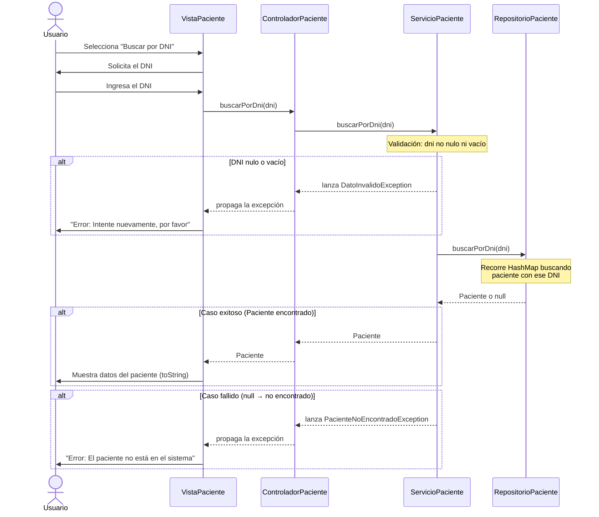

# Diagramas de Secuencia — Clínica Odontológica

---

## Caso 1: Alta de un nuevo turno

Muestra el flujo completo desde que el usuario ingresa los datos hasta que el turno queda guardado, incluyendo todas las validaciones y los caminos de excepción.

---

## Caso 2: Búsqueda de paciente por DNI

Muestra el caso exitoso (se encuentra al paciente) y el caso de excepción (no existe).

